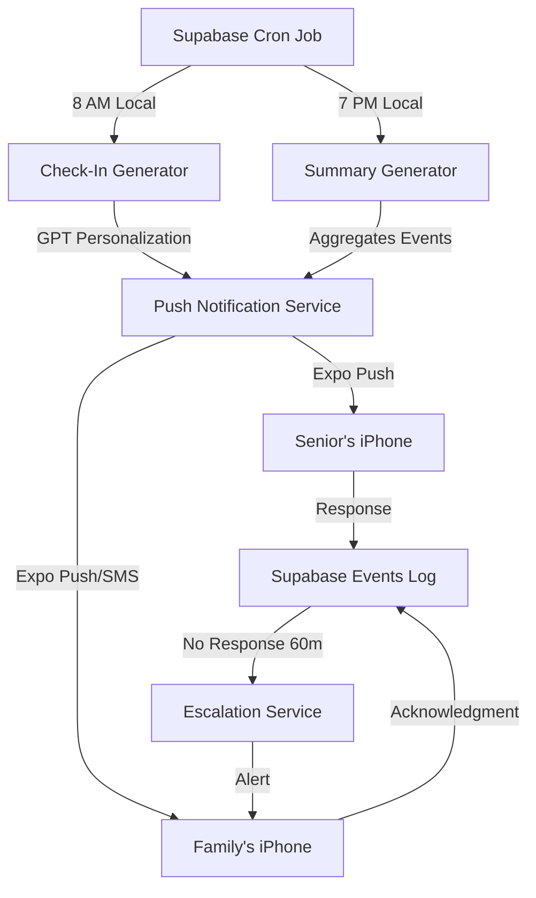

# Milo Daily Notification System — Product & Technical Spec

> "Milo checks in quietly every day — not to interrupt, but to reassure."

---

## 1. Purpose

The daily notification system is designed to:

1. **Keep seniors gently engaged** (habit formation, cognitive reassurance)
2. **Keep family informed** (without overwhelming them)
3. **Create a consistent daily rhythm** that builds trust and accountability

---

## 2. Notification Types

| Type | Audience | Timing | Primary Purpose |
|------|----------|--------|-----------------|
| **Daily Check-In** | Senior | Morning (8–10 AM) | Encourage brief "I'm OK" confirmation |
| **Daily Summary** | Family | Evening (6–8 PM) | Summarize senior's activity + health signals |
| **Reminder Alerts** | Senior | Configurable | Help complete tasks or meds |
| **Safety Alerts** | Family | Real-time | Only if fall or no-response detected |

---

## 3. Flow Overview

```
Scheduler → Generate Message → Local/Push Notification → User Interaction
   ↳ Senior responds → status logged → family summary updates
```

### Architecture Diagram



---

## 4. Senior Daily Check-In Flow

### Trigger Logic

- **Sent once per day** (default 9 AM local time)
- **Triggered by:**
  - Supabase cron job (`/notifications/checkin`)
  - Local iOS scheduling if offline
- **Suppressed if:**
  - Milo already had voice interaction within past 12 hrs (prevents annoyance)
  - Senior marked "Do Not Disturb" hours

### Notification Text (Examples)

| Situation | Copy | Voice Output |
|-----------|------|--------------|
| **Normal day** | "Good morning 👋 — tap to check in!" | "Hi Mary, how are you feeling today?" |
| **Missed prior day** | "We missed you yesterday — doing okay?" | "I didn't hear from you yesterday, are you alright?" |
| **Weather assist** | "It's chilly today. Don't forget your sweater!" | Adds personal warmth |
| **Positive reinforcement** | "You've checked in 7 days straight! 🎉" | Celebrates consistency |
| **After weekend** | "Hope you had a nice weekend — checking in!" | Friendly Monday tone |

### Senior Response Options

1. **Tap notification** → opens Milo with voice prompt
2. **Respond via voice:**
   - "I'm good." → marks as `ok`
   - "Not great." → logs low mood, suggests help (optional escalation)
   - "I'm fine." → marks as `ok`
   - "Need help." → immediate escalation to family
3. **No response** → triggers passive timer → potential escalation

### React Native Implementation

```typescript
import * as Notifications from 'expo-notifications';
import * as BackgroundFetch from 'expo-background-fetch';
import * as TaskManager from 'expo-task-manager';

const CHECKIN_TASK = 'daily-checkin';

// Define background task
TaskManager.defineTask(CHECKIN_TASK, async () => {
  const user = await getCurrentUser();
  
  if (!user || user.role !== 'senior') {
    return BackgroundFetch.BackgroundFetchResult.NoData;
  }

  // Check if already interacted today
  const lastInteraction = await getLastInteractionTime(user.id);
  const hoursSinceInteraction = (Date.now() - lastInteraction) / (1000 * 60 * 60);
  
  if (hoursSinceInteraction < 12) {
    console.log('Recent interaction, skipping check-in');
    return BackgroundFetch.BackgroundFetchResult.NoData;
  }

  // Schedule check-in notification
  await Notifications.scheduleNotificationAsync({
    content: {
      title: 'Good morning 👋',
      body: 'Tap to check in!',
      sound: 'gentle-chime.wav',
      categoryIdentifier: 'CHECKIN',
      data: {
        type: 'daily_checkin',
        user_id: user.id,
      },
    },
    trigger: {
      hour: user.notification_time_hour || 9,
      minute: 0,
      repeats: true,
    },
  });

  return BackgroundFetch.BackgroundFetchResult.NewData;
});

// Register background task
export async function registerCheckinTask() {
  await BackgroundFetch.registerTaskAsync(CHECKIN_TASK, {
    minimumInterval: 24 * 60 * 60, // 24 hours
    stopOnTerminate: false,
    startOnBoot: true,
  });
}

// Handle notification response
Notifications.addNotificationResponseReceivedListener(async (response) => {
  const { type, user_id } = response.notification.request.content.data;
  
  if (type === 'daily_checkin') {
    // Open app to voice prompt
    navigation.navigate('CheckIn', { fromNotification: true });
    
    // Log check-in interaction
    await supabase.from('events').insert({
      user_id,
      type: 'checkin_opened',
      timestamp: new Date().toISOString(),
    });
  }
});
```

---

## 5. Family Daily Summary Flow

### Timing

- **Default:** 7 PM local time (configurable)
- **Sent via:** Push + optional email
- **Frequency:** One message per linked senior

### Data Source

Aggregates daily events from Supabase:
- **reminders** (completed vs missed)
- **events** (falls, unresponsiveness)
- **check-ins** (status + mood)
- **voice interactions** (count + topics)

### Summary Copy Examples

| Condition | Message |
|-----------|---------|
| **All good** | "Mary checked in this morning and completed all reminders. 💚" |
| **Missed reminder** | "Mary missed her afternoon pills but checked in later. 🕓" |
| **No response** | "Milo didn't hear from Mary today — please check in." |
| **Fall alert** | "⚠️ Milo detected a possible fall at 3:42 PM. No response received yet." |
| **Very active** | "Mary had a chatty day! She asked Milo 5 questions and finished all reminders. ✨" |
| **Quiet day** | "Mary checked in but was quieter than usual today." |

### Supabase Edge Function: Daily Summary

```typescript
// supabase/functions/daily-summary/index.ts
import { serve } from 'https://deno.land/std@0.168.0/http/server.ts'
import { createClient } from 'https://esm.sh/@supabase/supabase-js@2'

serve(async (req) => {
  const supabase = createClient(
    Deno.env.get('SUPABASE_URL')!,
    Deno.env.get('SUPABASE_SERVICE_ROLE_KEY')!
  )

  // Get all family members who want daily summaries
  const { data: families } = await supabase
    .from('users')
    .select('*, family_links!family_links_family_id_fkey(*)')
    .eq('role', 'family')
    .eq('notification_prefs->daily_summary', true)

  for (const family of families || []) {
    for (const link of family.family_links) {
      const seniorId = link.senior_id
      
      // Get today's data
      const today = new Date().toISOString().split('T')[0]
      
      // Check-ins
      const { data: checkins } = await supabase
        .from('events')
        .select('*')
        .eq('user_id', seniorId)
        .eq('type', 'checkin')
        .gte('timestamp', today)
      
      // Reminders
      const { data: reminders } = await supabase
        .from('reminders')
        .select('*')
        .eq('user_id', seniorId)
        .gte('when_ts', today)
      
      // Generate summary
      const summary = await generateSummary({
        seniorName: link.users.display_name,
        checkins,
        reminders,
      })
      
      // Send notification
      await sendPushNotification(
        family.expo_push_token,
        `${link.users.display_name}'s Daily Summary`,
        summary
      )
      
      // Log notification
      await supabase.from('notifications').insert({
        user_id: family.id,
        type: 'summary',
        payload: { summary, senior_id: seniorId },
      })
    }
  }

  return new Response('Summaries sent', { status: 200 })
})

async function generateSummary({ seniorName, checkins, reminders }) {
  const hasCheckedIn = checkins.length > 0
  const completedReminders = reminders.filter(r => r.status === 'done')
  const missedReminders = reminders.filter(r => r.status === 'missed')
  
  if (!hasCheckedIn) {
    return `Milo didn't hear from ${seniorName} today — please check in.`
  }
  
  if (missedReminders.length > 0) {
    return `${seniorName} checked in but missed ${missedReminders.length} reminder${missedReminders.length > 1 ? 's' : ''}. 🕓`
  }
  
  return `${seniorName} checked in this morning and completed all reminders. 💚`
}
```

---

## 6. Escalation Logic (Safety Layer)

| Trigger | Delay | Action | Recipients |
|---------|-------|--------|------------|
| **No response after check-in** | 60 min | Second gentle ping | Senior |
| **Still no response** | +60 min | "Are you okay?" voice prompt | Senior |
| **No reply** | +30 min | Push + SMS alert | Family |
| **Fall detected** | Immediate | SMS + Push | Family |

**Important:** Escalations are logged in Supabase `events` table with type `escalation_alert`.

### Escalation Flow Implementation

```typescript
// Supabase Edge Function: Check Escalations
import { serve } from 'https://deno.land/std@0.168.0/http/server.ts'

serve(async (req) => {
  const supabase = createClient(...)
  
  // Find seniors who haven't checked in today
  const today = new Date().toISOString().split('T')[0]
  const now = new Date()
  const escalationTime = new Date(now.getTime() - 2.5 * 60 * 60 * 1000) // 2.5 hours ago
  
  const { data: seniors } = await supabase
    .from('users')
    .select('*, family_links!family_links_senior_id_fkey(*)')
    .eq('role', 'senior')
  
  for (const senior of seniors || []) {
    // Check for today's check-in
    const { data: todayCheckin } = await supabase
      .from('events')
      .select('*')
      .eq('user_id', senior.id)
      .eq('type', 'checkin')
      .gte('timestamp', today)
      .single()
    
    if (todayCheckin) continue // Already checked in
    
    // Check for escalation already sent
    const { data: escalation } = await supabase
      .from('events')
      .select('*')
      .eq('user_id', senior.id)
      .eq('type', 'escalation_alert')
      .gte('timestamp', today)
      .single()
    
    if (escalation) continue // Already escalated
    
    // Check if it's past escalation time (9 AM + 2.5 hours = 11:30 AM)
    const checkinTime = new Date(today + 'T09:00:00')
    const shouldEscalate = now > new Date(checkinTime.getTime() + 2.5 * 60 * 60 * 1000)
    
    if (!shouldEscalate) continue
    
    // Escalate to family
    for (const link of senior.family_links) {
      await sendPushNotification(
        link.users.expo_push_token,
        'Check-in Reminder',
        `Milo didn't hear from ${senior.display_name} today — please check in.`
      )
      
      // Optional: Send SMS for critical alerts
      if (link.users.phone) {
        await sendSMS(
          link.users.phone,
          `Milo didn't hear from ${senior.display_name} today. Please check in.`
        )
      }
    }
    
    // Log escalation
    await supabase.from('events').insert({
      user_id: senior.id,
      type: 'escalation_alert',
      payload: { reason: 'no_checkin', time: now.toISOString() },
    })
  }
  
  return new Response('Escalations checked', { status: 200 })
})
```

---

## 7. Technical Architecture

### Backend

**Scheduler:** Supabase Edge Function runs daily at 8 AM & 7 PM local time per user's timezone.

**Logic:**
1. Fetch users → group by role
2. Generate payloads via GPT summarizer for natural phrasing
3. Send via Firebase Cloud Messaging (push) or Twilio (SMS fallback)

### Data Structures

```sql
-- Notifications table
CREATE TABLE notifications (
  id UUID PRIMARY KEY DEFAULT uuid_generate_v4(),
  user_id UUID NOT NULL REFERENCES users(id) ON DELETE CASCADE,
  type TEXT NOT NULL CHECK (type IN ('checkin', 'summary', 'reminder', 'safety')),
  status TEXT DEFAULT 'sent' CHECK (status IN ('sent', 'ack', 'missed', 'escalated')),
  payload JSONB DEFAULT '{}',
  sent_at TIMESTAMPTZ DEFAULT NOW(),
  ack_at TIMESTAMPTZ,
  created_at TIMESTAMPTZ DEFAULT NOW()
);

-- Index for performance
CREATE INDEX idx_notifications_user_sent ON notifications(user_id, sent_at DESC);
CREATE INDEX idx_notifications_type_status ON notifications(type, status);
```

### API Endpoint

```typescript
POST /notifications/dispatch

Request:
{
  "user_id": "uuid",
  "type": "summary",
  "payload": {
    "title": "Mary's Daily Summary",
    "body": "Mary checked in and finished all reminders.",
    "mood": "good"
  }
}

Response:
{
  "notification_id": "uuid",
  "status": "sent",
  "sent_at": "2025-10-26T19:00:00Z"
}
```

### iOS Behavior

```typescript
import * as Notifications from 'expo-notifications';

// Configure notification handler
Notifications.setNotificationHandler({
  handleNotification: async (notification) => {
    const { type } = notification.request.content.data
    
    return {
      shouldShowAlert: true,
      shouldPlaySound: type === 'safety' ? true : false, // Only safety alerts make sound
      shouldSetBadge: true,
      priority: type === 'safety' ? 'max' : 'default',
    }
  },
})

// Set up notification categories
await Notifications.setNotificationCategoryAsync('CHECKIN', [
  {
    identifier: 'RESPOND_OK',
    buttonTitle: "I'm OK",
    options: {
      opensAppToForeground: false,
    },
  },
  {
    identifier: 'RESPOND_NEED_HELP',
    buttonTitle: 'Need Help',
    options: {
      opensAppToForeground: true,
    },
  },
])

// Handle action responses
Notifications.addNotificationResponseReceivedListener(async (response) => {
  const actionId = response.actionIdentifier
  const { user_id, type } = response.notification.request.content.data
  
  if (actionId === 'RESPOND_OK') {
    // Log positive check-in
    await supabase.from('events').insert({
      user_id,
      type: 'checkin',
      payload: { status: 'ok', method: 'notification_action' },
      timestamp: new Date().toISOString(),
    })
    
    // Update notification status
    await supabase.from('notifications')
      .update({ status: 'ack', ack_at: new Date().toISOString() })
      .eq('user_id', user_id)
      .eq('type', 'checkin')
      .is('ack_at', null)
    
    // Send confirmation
    await Notifications.scheduleNotificationAsync({
      content: {
        title: 'Thanks!',
        body: 'Your family has been notified.',
      },
      trigger: null,
    })
  }
  
  if (actionId === 'RESPOND_NEED_HELP') {
    // Immediate escalation
    await escalateToFamily(user_id, 'help_requested')
  }
})
```

**VoiceOver Support:**
- Notification body read aloud automatically
- Action buttons clearly labeled
- Haptic feedback on response

**Deep Linking:**
- Tap notification → opens "Today" tab in Milo
- Preserves navigation state

---

## 8. Personalization Logic

### GPT-Powered Message Generation

```typescript
async function generatePersonalizedCheckin(user: User) {
  const recentMood = await getRecentMoodTrend(user.id)
  const weather = await getLocalWeather(user.location)
  const dayOfWeek = new Date().toLocaleDateString('en-US', { weekday: 'long' })
  
  const prompt = `
Generate a warm, brief check-in message for ${user.display_name}, a senior.
Context:
- Recent mood: ${recentMood}
- Weather: ${weather.condition}, ${weather.temp}°F
- Day: ${dayOfWeek}
- Tone: ${user.prefs.tone || 'friendly'}

Keep it under 12 words. Make it feel personal, not robotic.
`

  const response = await openai.chat.completions.create({
    model: 'gpt-4o-mini',
    messages: [{ role: 'user', content: prompt }],
    max_tokens: 30,
  })
  
  return response.choices[0].message.content
}
```

### Weather Integration

```typescript
import * as Location from 'expo-location'

async function getLocalWeather(location: { lat: number, lng: number }) {
  // Use Apple WeatherKit API or OpenWeather
  const weather = await fetch(
    `https://api.openweathermap.org/data/2.5/weather?lat=${location.lat}&lon=${location.lng}&appid=${WEATHER_API_KEY}`
  ).then(r => r.json())
  
  return {
    condition: weather.weather[0].main,
    temp: Math.round(weather.main.temp),
    description: weather.weather[0].description,
  }
}

// Use in notification
const weather = await getLocalWeather(user.location)
if (weather.temp < 50) {
  message += " It's chilly today. Don't forget your sweater!"
}
```

### Contextual Phrases

- **Reminder context:** "You did great remembering your pills all week!"
- **Streak tracking:** "That's 10 days in a row! 🎉"
- **Seasonal:** "Happy first day of spring!"
- **Time-sensitive:** "Don't forget your doctor appointment at 2 PM today."

---

## 9. Opt-In / Settings

### Senior Settings

```typescript
interface SeniorNotificationPrefs {
  daily_checkin: boolean          // Default: true
  checkin_time_hour: number      // Default: 9
  checkin_time_minute: number    // Default: 0
  tone: 'friendly' | 'brief'      // Default: 'friendly'
  weather_tips: boolean           // Default: true
  do_not_disturb_start?: string  // e.g., "22:00"
  do_not_disturb_end?: string    // e.g., "07:00"
}
```

**Settings UI:**

```typescript
function NotificationSettings() {
  const [prefs, setPrefs] = useState<SeniorNotificationPrefs>({
    daily_checkin: true,
    checkin_time_hour: 9,
    checkin_time_minute: 0,
    tone: 'friendly',
    weather_tips: true,
  })

  const savePrefs = async () => {
    await supabase.from('users').update({
      notification_prefs: prefs,
    }).eq('id', userId)
  }

  return (
    <ScrollView style={styles.container}>
      <Text style={styles.title}>Notification Settings</Text>

      <View style={styles.setting}>
        <Text style={styles.label}>Daily Check-In</Text>
        <Switch
          value={prefs.daily_checkin}
          onValueChange={(value) => setPrefs({ ...prefs, daily_checkin: value })}
        />
      </View>

      <View style={styles.setting}>
        <Text style={styles.label}>Check-In Time</Text>
        <DateTimePicker
          value={new Date().setHours(prefs.checkin_time_hour, prefs.checkin_time_minute)}
          mode="time"
          onChange={(event, date) => {
            if (date) {
              setPrefs({
                ...prefs,
                checkin_time_hour: date.getHours(),
                checkin_time_minute: date.getMinutes(),
              })
            }
          }}
        />
      </View>

      <View style={styles.setting}>
        <Text style={styles.label}>Tone</Text>
        <Picker
          selectedValue={prefs.tone}
          onValueChange={(value) => setPrefs({ ...prefs, tone: value })}
        >
          <Picker.Item label="Friendly & Chatty" value="friendly" />
          <Picker.Item label="Brief & Simple" value="brief" />
        </Picker>
      </View>

      <TouchableOpacity style={styles.saveButton} onPress={savePrefs}>
        <Text style={styles.saveButtonText}>Save Settings</Text>
      </TouchableOpacity>
    </ScrollView>
  )
}
```

### Family Settings

```typescript
interface FamilyNotificationPrefs {
  daily_summary: boolean          // Default: true
  summary_time_hour: number       // Default: 19 (7 PM)
  safety_alerts: boolean          // Default: true
  missed_checkin_alerts: boolean  // Default: true
  delivery_method: 'push' | 'sms' | 'email' | 'all'  // Default: 'push'
  quiet_hours_start?: string      // e.g., "22:00"
  quiet_hours_end?: string        // e.g., "07:00"
}
```

**All stored in `prefs.notifications` JSON field:**

```sql
UPDATE users SET notification_prefs = jsonb_set(
  notification_prefs,
  '{daily_summary}',
  'true'
) WHERE id = 'user-id';
```

---

## 10. Metrics

| Metric | Target | How to Measure |
|--------|--------|----------------|
| **Daily check-in completion** | ≥ 85% seniors respond | Count `ack` notifications / total sent |
| **Average response latency** | ≤ 5 minutes | `ack_at - sent_at` average |
| **Family summary open rate** | ≥ 70% | Track notification opens |
| **False alerts** | ≤ 5% | Escalations that were unnecessary |
| **Fall alert confirmation response** | ≥ 90% within 15 minutes | Family response to safety alerts |
| **Notification suppression accuracy** | ≥ 95% | Don't send when recent interaction exists |

### Analytics Implementation

```typescript
// Track in Supabase
await supabase.from('analytics_events').insert({
  event_type: 'notification_sent',
  user_id: userId,
  metadata: {
    notification_type: 'checkin',
    sent_at: new Date().toISOString(),
  },
})

// Track response
await supabase.from('analytics_events').insert({
  event_type: 'notification_responded',
  user_id: userId,
  metadata: {
    notification_type: 'checkin',
    response_time_seconds: responseTime,
  },
})
```

---

## 11. Voice & Tone Examples

| Scenario | Voice Output | Goal |
|----------|--------------|------|
| **Morning check-in** | "Hi Mary, how are you feeling today?" | Gentle, familiar |
| **No reply follow-up** | "Just checking in again — everything okay?" | Concerned, not alarming |
| **Family summary** | "Mary had a good day and finished all reminders." | Confidence |
| **Safety escalation** | "Mary hasn't checked in yet. Please reach out." | Calm urgency |
| **Positive reinforcement** | "Great job! That's a week straight!" | Celebratory |
| **Weather warning** | "It's icy outside — be extra careful today." | Protective |

---

## 12. Future Enhancements

### Phase 2 (Post-MVP)
- **Mood tracking** ("I'm fine / Tired / Happy") → optional journaling
- **Activity integration** (Apple Health step count) → "You walked 3,000 steps today!"
- **Multi-senior families** → dashboard view of multiple loved ones
- **AI anomaly detection** → unusual routine changes flagged

### Phase 3 (Advanced)
- **Video check-ins** → Optional FaceTime-like quick call
- **Smart home integration** → "Lights were on late last night"
- **Medication adherence** → Photo verification of pills taken
- **Emergency contacts** → Automatic 911 call if no response + fall

---

## Tagline

> **"Milo's daily check-ins feel like care, not control."**

---

## Implementation Checklist

### Backend
- [ ] Create Supabase cron jobs (8 AM, 7 PM)
- [ ] Build `/notifications/dispatch` endpoint
- [ ] Implement GPT message personalization
- [ ] Add escalation logic
- [ ] Set up Twilio SMS fallback
- [ ] Create analytics tracking

### iOS/Frontend
- [ ] Configure notification categories
- [ ] Handle notification actions
- [ ] Build settings UI (senior + family)
- [ ] Implement deep linking
- [ ] Add VoiceOver support
- [ ] Test background fetch

### Testing
- [ ] Test notification delivery (push + SMS)
- [ ] Verify escalation timing
- [ ] Test with Do Not Disturb mode
- [ ] Validate timezone handling
- [ ] Test on various iOS versions
- [ ] Accessibility audit (VoiceOver)

---

**Next Steps:**
1. Build Supabase Edge Functions for scheduling
2. Implement notification handler in React Native
3. Create settings UI for both user types
4. Test notification flow end-to-end
5. Beta test with 10 families for 1 week

**Related Docs:**
- `TECHNICAL_SPEC.md` - API specifications
- `ONBOARDING_SPEC.md` - Initial setup flow
- `DESIGN_SPEC.md` - UI for notification settings
- `PRD.md` - Product vision and metrics

