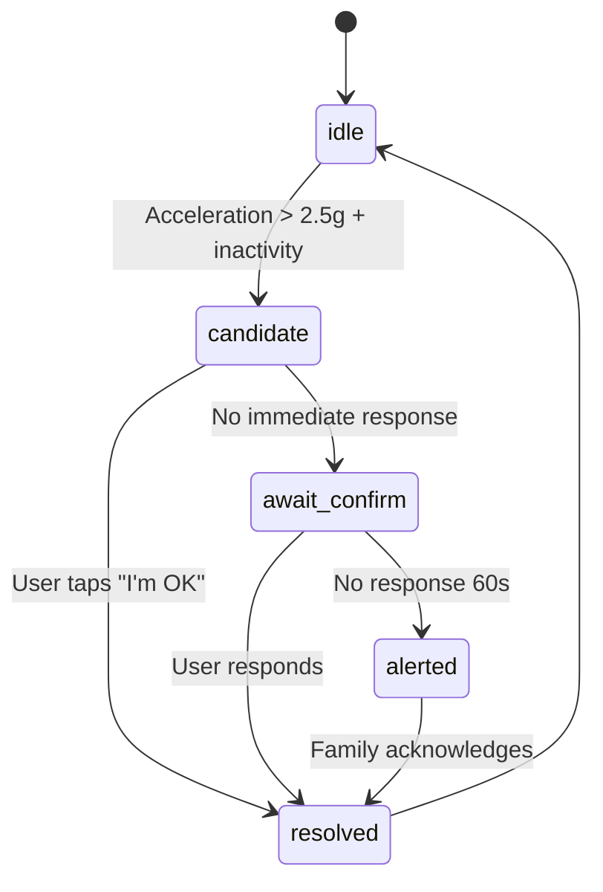

# Technical Handoff Specification (MVP)

This section defines API endpoints, data models, sample payloads, event flows, guardrails, and QA for Milo v0.2 (with Fall Awareness). Ready for handoff to iOS + backend engineers.

## 1) API Surface (Supabase Edge Functions)

**Base URL (Edge):** `https://<project>.supabase.co/functions/v1`  
**Auth:** Bearer JWT (Supabase Auth). All endpoints enforce RLS.

### 1.1 `/auth/magic-link` (POST)

Generate and email an auth magic link for senior/family.

**Request:**
```json
{
  "email": "alice@example.com",
  "role": "senior" // or "family"
}
```

**Response:**
```json
200 { "status": "sent" }
```

---

### 1.2 `/ask` (POST)

Voice/text → GPT → concise response + optional TTS URL.

**Request:**
```json
{
  "user_id": "uuid",
  "text": "What does Medicare Part B cover?",
  "context": {
    "tone": "warm",
    "max_words": 20
  },
  "tts": true
}
```

**Response:**
```json
200
{
  "message_id": "uuid",
  "response_text": "Medicare Part B helps pay for doctor visits and outpatient care.",
  "tts_url": "https://…/audio/uuid.mp3"
}
```

---

### 1.3 `/explain` (POST)

OCR → summary. Accepts image URL or base64.

**Request:**
```json
{
  "user_id": "uuid",
  "image_b64": "data:image/jpeg;base64,….",
  "purpose": "insurance_letter"
}
```

**Response:**
```json
200
{
  "doc_id": "uuid",
  "summary": "Your appointment moved to Nov 8. No extra cost.",
  "confidence": 0.91
}
```

---

### 1.4 `/reminders` (POST|GET|PUT|DELETE)

Create/update/delete reminders. Natural-language parsing supported on POST.

**POST Request:**
```json
{
  "user_id": "uuid",
  "text": "Pills at 8 pm",
  "when_iso": "2025-11-01T20:00:00Z"
}
```

**Response:**
```json
200 { "reminder_id": "uuid" }
```

---

### 1.5 `/events/fall` (POST)

Upstream from iOS when a fall candidate is detected or resolved.

**Request:**
```json
{
  "user_id": "uuid",
  "event_type": "fall_candidate|fall_confirmed|resolved",
  "accel_g": 2.9,
  "inactive_secs": 75,
  "location": {
    "lat": 37.8,
    "lng": -122.2
  },
  "battery": 0.52
}
```

**Response:**
```json
200 { "event_id": "uuid" }
```

---

### 1.6 `/alerts/dispatch` (POST)

Server-to-server: push/SMS/email to contacts for high-priority events.

**Request:**
```json
{
  "user_id": "uuid",
  "event_id": "uuid",
  "channel": ["push", "sms"],
  "message": "Possible fall at 3:42 PM. No response yet.",
  "meta": {
    "battery": 0.52
  }
}
```

**Response:**
```json
200 { "sent": true }
```

---

### 1.7 `/contacts` (POST|GET|DELETE)

Manage family contacts for a user.

**Request:**
```json
{
  "user_id": "uuid",
  "name": "Laura",
  "phone": "+1415…",
  "email": "laura@…"
}
```

---

## 2) Data Model (Supabase / Postgres)

All tables with RLS policies: users can only see their rows; family can see senior-linked rows via `family_links`.

### `users`
```sql
CREATE TABLE users (
  id UUID PRIMARY KEY DEFAULT uuid_generate_v4(),
  role TEXT NOT NULL CHECK (role IN ('senior', 'family')),
  display_name TEXT NOT NULL,
  phone TEXT,
  email TEXT UNIQUE,
  prefs JSONB DEFAULT '{}', -- voice, tts, accessibility settings
  created_at TIMESTAMPTZ DEFAULT NOW()
);
```

### `family_links`
```sql
CREATE TABLE family_links (
  id UUID PRIMARY KEY DEFAULT uuid_generate_v4(),
  senior_id UUID NOT NULL REFERENCES users(id) ON DELETE CASCADE,
  family_id UUID NOT NULL REFERENCES users(id) ON DELETE CASCADE,
  relation TEXT, -- 'daughter', 'son', 'caregiver'
  created_at TIMESTAMPTZ DEFAULT NOW(),
  UNIQUE(senior_id, family_id)
);
```

### `messages`
```sql
CREATE TABLE messages (
  id UUID PRIMARY KEY DEFAULT uuid_generate_v4(),
  user_id UUID NOT NULL REFERENCES users(id) ON DELETE CASCADE,
  input_text TEXT,
  response_text TEXT,
  tts_url TEXT,
  labels JSONB DEFAULT '{}', -- {"mode": "ask"|"explain"}
  created_at TIMESTAMPTZ DEFAULT NOW()
);
```

### `ocr_docs`
```sql
CREATE TABLE ocr_docs (
  id UUID PRIMARY KEY DEFAULT uuid_generate_v4(),
  user_id UUID NOT NULL REFERENCES users(id) ON DELETE CASCADE,
  summary TEXT,
  confidence FLOAT,
  source_url TEXT,
  created_at TIMESTAMPTZ DEFAULT NOW()
);
```

### `reminders`
```sql
CREATE TABLE reminders (
  id UUID PRIMARY KEY DEFAULT uuid_generate_v4(),
  user_id UUID NOT NULL REFERENCES users(id) ON DELETE CASCADE,
  text TEXT NOT NULL,
  when_ts TIMESTAMPTZ NOT NULL,
  status TEXT DEFAULT 'scheduled' CHECK (status IN ('scheduled', 'sent', 'done', 'missed')),
  created_at TIMESTAMPTZ DEFAULT NOW()
);
```

### `events`
```sql
CREATE TABLE events (
  id UUID PRIMARY KEY DEFAULT uuid_generate_v4(),
  user_id UUID NOT NULL REFERENCES users(id) ON DELETE CASCADE,
  type TEXT NOT NULL, -- 'fall_candidate', 'fall_confirmed', 'resolved'
  payload JSONB DEFAULT '{}', -- accel, inactive_secs, battery, location
  created_at TIMESTAMPTZ DEFAULT NOW()
);
```

### `contacts`
```sql
CREATE TABLE contacts (
  id UUID PRIMARY KEY DEFAULT uuid_generate_v4(),
  user_id UUID NOT NULL REFERENCES users(id) ON DELETE CASCADE,
  name TEXT NOT NULL,
  phone TEXT,
  email TEXT,
  notify_channels TEXT[] DEFAULT ARRAY['push'], -- ['push','sms','email']
  priority SMALLINT DEFAULT 1, -- 1,2,3 escalation order
  created_at TIMESTAMPTZ DEFAULT NOW()
);
```

### `subscriptions`
```sql
CREATE TABLE subscriptions (
  id UUID PRIMARY KEY DEFAULT uuid_generate_v4(),
  payer_id UUID NOT NULL REFERENCES users(id) ON DELETE CASCADE,
  plan TEXT NOT NULL CHECK (plan IN ('free', 'plus', 'premium')),
  renewal_date DATE,
  status TEXT DEFAULT 'active',
  created_at TIMESTAMPTZ DEFAULT NOW()
);
```

---

## 3) Event Flows & State Machines

### 3.1 Fall Awareness State Machine

**States:** `idle` → `candidate` → `await_confirm` (60s) → `alerted` → `resolved`

**Flow:**
1. Enter `candidate` on `accel_g > 2.5g` + orientation change
2. If device active or user taps **"I'm OK"** → `resolved` (no alert)
3. If no response after 60s → `alerted` (dispatch to contacts in priority order)
4. If any contact acknowledges → store `ack_at` on events



---

### 3.2 Reminder Flow

1. `POST /reminders` → row inserted in `reminders` table
2. Cron job/Edge Function checks due reminders each minute
3. iOS local push notification sent
4. User taps **"Done"** → `status = 'done'`
5. Missed after 30m → `status = 'missed'` (optional weekly digest to family)

```
┌──────────────┐
│ Create       │
│ Reminder     │
└──────┬───────┘
       │
       ▼
┌──────────────┐
│ scheduled    │
└──────┬───────┘
       │
       ▼ (at due time)
┌──────────────┐
│ sent         │
└──────┬───────┘
       │
       ├──► User taps "Done" ──► done
       │
       └──► 30 min timeout ──► missed
```

---

### 3.3 Explain Flow

1. iOS uploads image to Supabase Storage → signed URL
2. POST to `/explain` with image URL or base64
3. Google Vision OCR extracts text
4. GPT-4o summarizes
5. Store in `ocr_docs` + `messages`
6. Return summary + TTS audio
7. Speak reply to user

```
Image → Upload → /explain → OCR → GPT → Summary → TTS → Spoken
   ↓                            ↓
Storage                    ocr_docs
```

---

## 4) iOS App Contracts (Swift)

### 4.1 Voice Session

- Use `AVAudioSessionCategoryPlayAndRecord`
- 8–12 kHz mono; max 30s clip
- Fallback to partial streaming if network slow

```swift
let audioSession = AVAudioSession.sharedInstance()
try audioSession.setCategory(.playAndRecord, mode: .default)
try audioSession.setActive(true)
```

---

### 4.2 Background Tasks

- `BGProcessingTaskRequest` for periodic sensor sampling upload
- Motion manager sampling window: **10 Hz for 3s bursts every 10s** (tunable)

```swift
BGTaskScheduler.shared.register(forTaskWithIdentifier: "com.milo.fall-detection") { task in
    self.handleFallDetectionTask(task: task as! BGProcessingTask)
}
```

---

### 4.3 Permissions Copy (Plain-English)

| Permission | User-facing copy |
|------------|------------------|
| **Motion** | "Milo uses motion to notice hard bumps so it can ask if you're okay." |
| **Notifications** | "Milo reminds you at the times you choose." |
| **Photos** | "Only when you choose a photo to explain." |
| **Location (optional)** | "Adds an address to a safety alert for your family." |

---

## 5) Guardrails & Safety

### Prompt Policy
- Cap responses to **20 words**
- Avoid medical/legal advice
- Suggest contacting a trusted person when needed

**Example System Prompt:**
```
You are Milo, a kind AI assistant for older adults.
- Always respond in 20 words or less
- Use warm, simple language
- Never give medical or legal advice
- If uncertain, suggest "Would you like me to tell your family?"
```

### Scam Detection Heuristic
- Regex/LLM flags for:
  - Urgent payment requests
  - Gift cards
  - Bank login requests
- Prepend response: *"This could be a scam. Don't click. Want me to tell your family?"*

**Detection patterns:**
```
/urgent.*payment|wire.*money|gift.*card|verify.*account|social.*security/i
```

### Privacy
- **No continuous audio recording**
- All audio deleted after transcription unless user saves
- No photos stored permanently (OCR processed, then deleted)

### RLS Examples
```sql
-- Users can only see their own messages
CREATE POLICY "Users can read own messages" ON messages
  FOR SELECT USING (auth.uid() = user_id);

-- Family can see senior's messages via family_links
CREATE POLICY "Family can read linked senior messages" ON messages
  FOR SELECT USING (
    user_id IN (
      SELECT senior_id FROM family_links WHERE family_id = auth.uid()
    )
  );
```

---

## 6) Monitoring & Observability

### Edge Function Logs
- Function latency: p50 / p95
- Error rate per endpoint
- Request volume per user

### App Analytics (Privacy-safe)
- Task counts per mode (ask/explain/remind)
- Daily active seniors
- Reminder success rate (sent vs. completed)

### Alerting
- **Slack pager** on dispatch failures > 2% in 15m window
- Error rate threshold: > 5% triggers page
- Latency threshold: p95 > 5s triggers warning

**Example Monitoring Dashboard:**
```
┌─────────────────────────────────────────┐
│  Milo API Health                        │
├─────────────────────────────────────────┤
│  /ask         p50: 1.2s  p95: 2.8s  ✅  │
│  /explain     p50: 3.1s  p95: 4.9s  ✅  │
│  /reminders   p50: 0.3s  p95: 0.8s  ✅  │
│  /events/fall p50: 0.5s  p95: 1.2s  ✅  │
├─────────────────────────────────────────┤
│  Error Rate:  0.3%                  ✅  │
│  Active Users: 47                       │
│  Alerts Sent:  3 (last hour)            │
└─────────────────────────────────────────┘
```

---

## 7) QA Plan (MVP)

### Accessibility Pass
- ✅ Dynamic Type XXL support
- ✅ VoiceOver scripts for all screens
- ✅ Minimum touch target: 44×44pt
- ✅ High contrast mode support

### Network Resilience
- ✅ 3G simulation testing
- ✅ Offline retries with exponential backoff
- ✅ Request timeout: 10s
- ✅ Queue failed requests for retry

### Sensor Simulation
- ✅ Xcode motion replay traces (falls, drops, normal use)
- ✅ Test scenarios:
  - Hard fall (>3g)
  - Phone drop (<2g)
  - Sitting down quickly
  - Getting into car
- ✅ Target: **<5% false positives**

### False Positive Test Cases

| Scenario | Expected | Actual |
|----------|----------|--------|
| Drop phone on couch | No alert | TBD |
| Put phone in pocket | No alert | TBD |
| Actual fall + no movement | Alert | TBD |
| Trip but catch self | No alert (user active) | TBD |
| Set phone down hard | No alert | TBD |

### Localization Smoke Test
- ✅ EN (US English) - primary
- 🔜 ES (Spanish) - prepare strings

---

## 8) Rollout & Feature Flags

### Feature Flags (LaunchDarkly or custom)

```json
{
  "fall_awareness": {
    "enabled": false,
    "rollout": 0.1  // 10% of users
  },
  "family_dashboard": {
    "enabled": true,
    "rollout": 1.0
  },
  "sms_fallback": {
    "enabled": false,
    "rollout": 0.0
  },
  "gpt4o_model": {
    "enabled": true,
    "model": "gpt-4o-mini"
  }
}
```

### Canary Cohort
- **Initial:** 50 seniors / 25 families
- **Success Criteria:**
  - p95 response time < 3s
  - False positives < 5%
  - NPS > 40
- **Widen:** Increase to 500 users after 1 week

---

## 9) Pricing & Entitlements (RevenueCat)

### Free Tier
- Ask: 10 queries/day
- Explain: 2 documents/day
- Reminders: 3 active reminders

### Plus ($9.99/mo)
- ✅ Unlimited Ask
- ✅ Unlimited Explain
- ✅ Unlimited Reminders
- ✅ Family digest (weekly email)
- ✅ Basic fall alerts (push/email)

### Premium ($14.99/mo)
- ✅ Everything in Plus
- ✅ SMS escalation
- ✅ Multi-contact priority alerts
- ✅ Location included in alerts
- ✅ Priority support

### Implementation with RevenueCat

```swift
Purchases.configure(withAPIKey: "your_revenuecat_key")

// Check entitlement
Purchases.shared.getCustomerInfo { (customerInfo, error) in
    if customerInfo?.entitlements["plus"]?.isActive == true {
        // User has Plus subscription
        unlimitedFeatures = true
    }
}
```

---

## 10) Open Questions (to resolve in sprint 0)

### Technical Decisions

| Question | Options | Recommendation |
|----------|---------|----------------|
| **Minimum iOS version** | iOS 15+ / iOS 16+ / iOS 17+ | **iOS 16+** (Live Activities, better CoreMotion) |
| **TTS provider** | Apple Neural (free, local) vs. ElevenLabs (quality, cost) | **Apple Neural** for MVP, ElevenLabs for Premium |
| **SMS provider** | Twilio vs. AWS SNS | **Twilio** (better deliverability, easier API) |
| **Battery benchmarks** | Test on iPhone 8/SE vs. newer models | **Run 48hr test on iPhone 8** before launch |

### Cost Analysis

| Service | Free Tier | Plus ($9.99) | Premium ($14.99) | Delta |
|---------|-----------|--------------|------------------|-------|
| OpenAI API | $0.50/user | $1.50/user | $2.00/user | Unlimited queries |
| TTS | $0 (Apple) | $0 (Apple) | $0.30/user (ElevenLabs) | Better voice |
| SMS | $0 | $0 | $0.50/user | Twilio alerts |
| **Total COGS** | **$0.50** | **$1.50** | **$2.80** | |
| **Gross Margin** | **-$0.50** | **$8.49 (85%)** | **$12.19 (81%)** | |

### Battery Benchmarks (To Test)

- **Target:** < 5% battery drain per day
- **Test devices:**
  - iPhone 8 (older hardware)
  - iPhone SE 2nd gen
  - iPhone 12/13 (typical)
  - iPhone 15 Pro (latest)
- **Scenarios:**
  - Passive monitoring (10 Hz, 3s bursts)
  - Active use (5 voice queries/day)
  - Background only

---

## 11) Development Phases

### Sprint 0 (Week 1-2): Foundation
- [ ] Set up Supabase project
- [ ] Create database schema
- [ ] Deploy Edge Functions scaffolding
- [ ] Set up monitoring (Sentry + Mixpanel)
- [ ] Resolve open questions

### Sprint 1 (Week 3-4): Voice + AI
- [ ] Implement `/ask` endpoint
- [ ] Integrate GPT-4o
- [ ] Build voice UI (tap-to-talk)
- [ ] Add Apple Neural TTS
- [ ] Test on 5 internal users

### Sprint 2 (Week 5-6): Fall Detection
- [ ] Implement CoreMotion tracking
- [ ] Build fall detection algorithm
- [ ] Create `/events/fall` endpoint
- [ ] Add family alert dispatch
- [ ] Test false positive rate

### Sprint 3 (Week 7-8): OCR + Reminders
- [ ] Implement `/explain` endpoint
- [ ] Integrate Google Vision OCR
- [ ] Build reminder system
- [ ] Create family dashboard v1
- [ ] Beta test with 50 users

### Sprint 4 (Week 9-10): Polish + Launch
- [ ] Accessibility audit
- [ ] Performance optimization
- [ ] Add subscription (RevenueCat)
- [ ] TestFlight → App Store
- [ ] Launch! 🚀

---

## 12) API Client Examples

### iOS Client (Swift)

```swift
// Ask endpoint
func askMilo(question: String) async throws -> AskResponse {
    let request = AskRequest(
        user_id: currentUser.id,
        text: question,
        context: ["tone": "warm", "max_words": 20],
        tts: true
    )
    
    let response = try await supabase.functions
        .invoke("ask", body: request)
    
    return try JSONDecoder().decode(AskResponse.self, from: response)
}

// Fall detection
func reportFallEvent(accelG: Double, inactiveSecs: Int) async throws {
    let event = FallEvent(
        user_id: currentUser.id,
        event_type: "fall_candidate",
        accel_g: accelG,
        inactive_secs: inactiveSecs,
        location: currentLocation,
        battery: UIDevice.current.batteryLevel
    )
    
    try await supabase.functions.invoke("events/fall", body: event)
}
```

---

## End of Technical Handoff Spec 🚀

**Next Steps:**
1. Review and approve this spec
2. Set up development environment
3. Create tickets in project management tool
4. Assign to iOS + backend engineers
5. Schedule sprint 0 kickoff

**Questions?** Contact the product team or refer to:
- `PRD.md` for product vision
- `SYSTEM_ARCHITECTURE.md` for high-level architecture
- `MIGRATION_PLAN.md` for implementation roadmap

